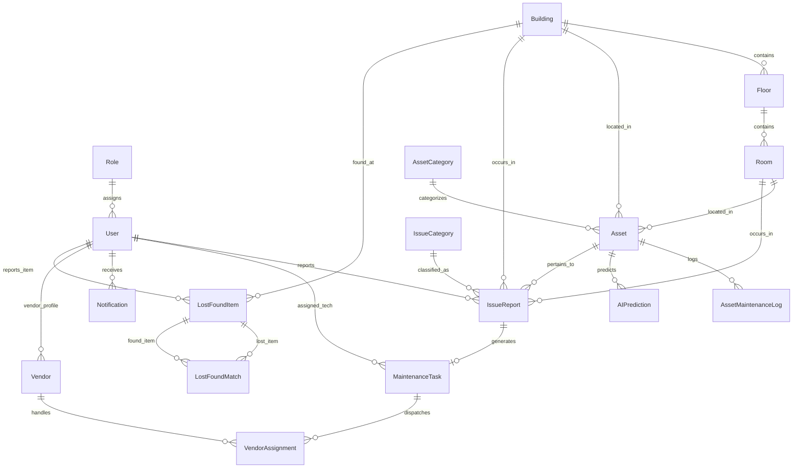

# Entity Relationship (ER) Diagram

The following Mermaid diagram represents the relational schema and relationships in the **Campus Infrastructure Intelligence** database.

---

## Relationship Summary

1. **User & Role**: Each `User` belongs to one `Role` (`ADMIN`, `TECHNICIAN`, `STUDENT`, `FACULTY`, `VENDOR`).
2. **Building Hierarchy**: `Building` (1) -> `Floor` (N) -> `Room` (N).
3. **Assets**: Belong to a `Building`, `Room`, and `AssetCategory`.
4. **Issue Reports**: Filed by a `User` against a `Building`, `Room`, and optional `Asset`.
5. **Maintenance Tasks**: Generated from an `IssueReport` and assigned to a `User` (`TECHNICIAN`) or `Vendor`.
6. **Lost & Found**: `LostFoundItem` records linked to users, buildings, and paired via `LostFoundMatch`.
